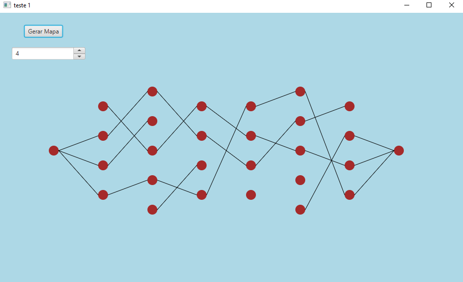

## Projeto_Teoria_dos_Grafos
Projeto apresentado a disciplina de teoria dos grafos para obtenção de nota.

#### Contém uma pasta destinada as atividades realizadas na disciplina.

atributos: poder, habilidade, armadura e resistencia.
atributos gerais: ataque, defesa e vida.
classes: dijkstra, warshall e euler.
obs: cada classe um atributo especifico, com 6 atributos gerais para qua cada jogador escolhe apenas 1.
obs2: cada atributo especifico de classe tem relação com um algoritmo.
Cada usuario personaliza seu proprio personagem de acordo com as regras, semelhante a um rpg de mesa.

Embora o jogo não esteja finalizado(longe disso). O principal desafio foi completado, geração automatica do mapa. O existem 3 arquivos "main", mas o que deve ser executado é o MapaFX.java, os demais são para testes dos algoritmos utilizados.

##### Imangens dos grafos gerados:

1. 

2. 

3. 
